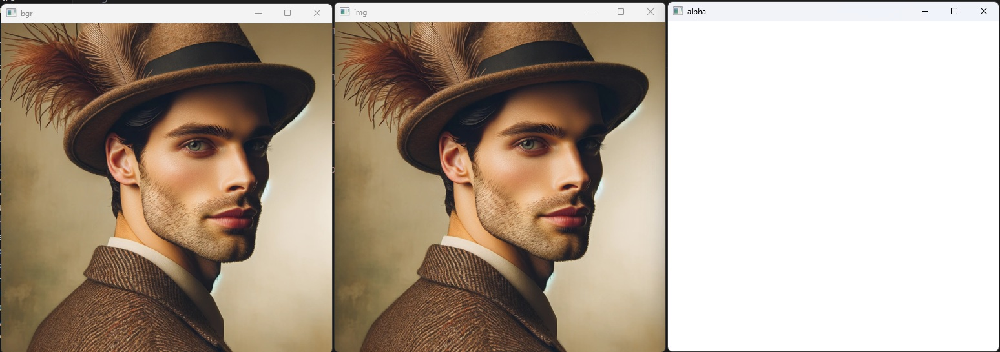
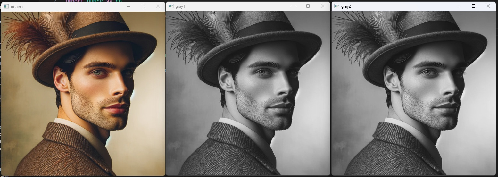
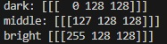
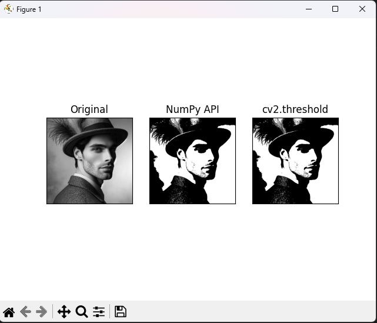
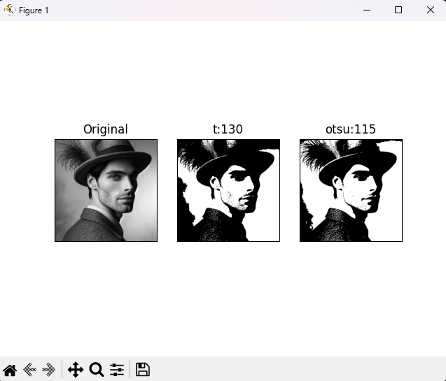

# OpenCV - Day 2

## 📡 Image Operations

**Date:** 2025-07-29  
**Author:** Sang-Min Byun

---

<br>

## 📋 Project Summary

⚫ **Image Operations**

This project demonstrates image **color processing**, binary image generation through **thresholding**, and image **compositing**.

The core idea:
- The image colors are represented using 3 methods: BGR(BGRA), HSV, YUV.
- Generate a binary image through thresholding using Otsu's binarization method to find optimal threshold without iteration.
- Using masking, extract only the subject from a photo with a chroma key background, and then composite it with a photo of a different background.
  - The photo with a chroma key background should be smaller than the other photo that be composited.


<br>

## 🟥 Representing the image colors

### 📷 Python Code (color.py)

This code displays the image in three formats: the original format, BGR format, and BGRA format.

```python
import cv2
import numpy as np

# 기본값
img = cv2.imread('../img/like_lenna.png')

# bgr
bgr = cv2.imread('../img/like_lenna.png', cv2.IMREAD_COLOR)

# a
bgra = cv2.imread('../img/like_lenna.png', cv2.IMREAD_UNCHANGED)

# shape
print("default", img.shape, "color", bgr.shape, "unchanged", bgra.shape)

# 이미지 보여주기
cv2.imshow('img', img)
cv2.imshow('bgr', bgr)
cv2.imshow('alpha', bgra[:,:,3])

cv2.waitKey(0)
cv2.destroyAllWindows()

```

### 📷 **Result Screenshot:**


<br>

---

<br>

### 📷 Python Code (bgr2gray.py)

This code displays the image in three format: the original format, gray format 1, gray format 2.  
Gray format 1 image is generated by method using average value.  
Gray format 2 image is generated by method using cv2.cvtcolor(img, flag) function.

```python
import cv2
import numpy as np

img = cv2.imread('../img/like_lenna.png')

img2 = img.astype(np.uint16)                # dtype 변경 ---①
b,g,r = cv2.split(img2)                     # 채널 별로 분리 ---②
#b,g,r = img2[:,:,0], img2[:,:,1], img2[:,:,2]
gray1 = ((b + g + r)/3).astype(np.uint8)    # 평균 값 연산후 dtype 변경 ---③

gray2 = cv2.cvtColor(img, cv2.COLOR_BGR2GRAY) # BGR을 그레이 스케일로 변경 ---④
cv2.imshow('original', img)
cv2.imshow('gray1', gray1)
cv2.imshow('gray2', gray2)

cv2.waitKey(0)
cv2.destroyAllWindows()

```

### 📷 **Result Screenshot:**


<br>

---

<br>

### 📷 Python Code (bgr2hsv.py, bgr2yuv.py)

These codes display the image in RGB color system.  
The two codes convert the BGR format into the HSV and YUV formats, respectively.

```python
# BGR 값을 HSV로 변환

import cv2
import numpy as np

#---① BGR 컬러 스페이스로 원색 픽셀 생성
red_bgr = np.array([[[0,0,255]]], dtype=np.uint8)   # 빨강 값만 갖는 픽셀
green_bgr = np.array([[[0,255,0]]], dtype=np.uint8) # 초록 값만 갖는 픽셀
blue_bgr = np.array([[[255,0,0]]], dtype=np.uint8)  # 파랑 값만 갖는 픽셀
yellow_bgr = np.array([[[0,255,255]]], dtype=np.uint8) # 노랑 값만 갖는 픽셀

#---② BGR 컬러 스페이스를 HSV 컬러 스페이스로 변환
red_hsv = cv2.cvtColor(red_bgr, cv2.COLOR_BGR2HSV);
green_hsv = cv2.cvtColor(green_bgr, cv2.COLOR_BGR2HSV);
blue_hsv = cv2.cvtColor(blue_bgr, cv2.COLOR_BGR2HSV);
yellow_hsv = cv2.cvtColor(yellow_bgr, cv2.COLOR_BGR2HSV);

#---③ HSV로 변환한 픽셀 출력
print("red:",red_hsv)
print("green:", green_hsv)
print("blue", blue_hsv)
print("yellow", yellow_hsv)

```

### 📷 **Result Screenshot:**


<br>

---

<br>

```python
# BGR 값을 YUV로 변환

import cv2
import numpy as np

#---① BGR 컬러 스페이스로 3가지 밝기의 픽셀 생성
dark = np.array([[[0,0,0]]], dtype=np.uint8)        # 3 채널 모두 0인 가장 어두운 픽셀
middle = np.array([[[127,127,127]]], dtype=np.uint8) # 3 채널 모두 127인 중간 밝기 픽셀
bright = np.array([[[255,255,255]]], dtype=np.uint8) # 3 채널 모두 255인 가장 밝은 픽셀

#---② BGR 컬러 스페이스를 YUV 컬러 스페이스로 변환
dark_yuv = cv2.cvtColor(dark, cv2.COLOR_BGR2YUV)
middle_yuv = cv2.cvtColor(middle, cv2.COLOR_BGR2YUV)
bright_yuv = cv2.cvtColor(bright, cv2.COLOR_BGR2YUV)

#---③ YUV로 변환한 픽셀 출력
print("dark:",dark_yuv)
print("middle:", middle_yuv)
print("bright", bright_yuv)

```

### 📷 **Result Screenshot:**


<br>

---

<br>

### 📷 Python Code (threshold.py)

Global thresholding is a method where a certain threshold is set, and pixel values are assigned 255 if they exceed the threshold, or 0 if they do not.  
The code below displays the process activating global thresholding through numpy and cv2.threshold().

```python
import cv2
import numpy as np
import matplotlib.pylab as plt

# 이미지를 그레이 스케일로 읽기
img = cv2.imread('../img/like_lenna.png', cv2.IMREAD_GRAYSCALE)

# NumPy API로 바이너리 이미지 만들기
thresh_np = np.zeros_like(img)   # 원본과 동일한 크기의 0으로 채워진 이미지
thresh_np[ img > 127] = 255      # 127 보다 큰 값만 255로 변경

# OpenCV API로 바이너리 이미지 만들기
ret, thresh_cv = cv2.threshold(img, 127, 255, cv2.THRESH_BINARY)
# 바이너리 이미지에 사용된 문턱 값 반환
print(ret)

# 원본과 결과물을 matplotlib으로 출력
imgs = {'Original': img, 'NumPy API':thresh_np, 'cv2.threshold': thresh_cv}
for i , (key, value) in enumerate(imgs.items()):
    plt.subplot(1, 3, i+1)
    plt.title(key)
    plt.imshow(value, cmap='gray')
    plt.xticks([]); plt.yticks([])

plt.show()

```

### 📷 **Result Screenshot:**


<br>

---

<br>

### 📷 Python Code (threshold_otsu.py)

This code finds optimal threshold using Otsu's binarization method.

```python
import cv2
import numpy as np
import matplotlib.pylab as plt


# 이미지를 그레이 스케일로 읽기
img = cv2.imread('../img/like_lenna.png', cv2.IMREAD_GRAYSCALE)

# 경계값을 130으로 지정
_, t_130 = cv2.threshold(img, 130, 255, cv2.THRESH_BINARY)

# 경계값을 지정하지 않고 OTSU 알고리즘 선택
t, t_otsu = cv2.threshold(img, -1, 255, cv2.THRESH_BINARY | cv2.THRESH_OTSU)

# OTSU 알고리즘으로 선택된 경계값 출력
print('otsu threshold:', t)

imgs = {'Original': img, 't:130':t_130, 'otsu:%d'%t: t_otsu}
for i , (key, value) in enumerate(imgs.items()):
    plt.subplot(1, 3, i+1)
    plt.title(key)
    plt.imshow(value, cmap='gray')
    plt.xticks([]); plt.yticks([])

plt.show()

```

### 📷 **Result Screenshot:**


<br>

---

<br>
