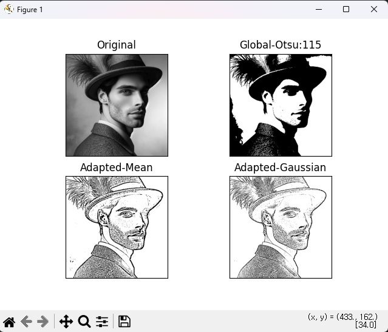
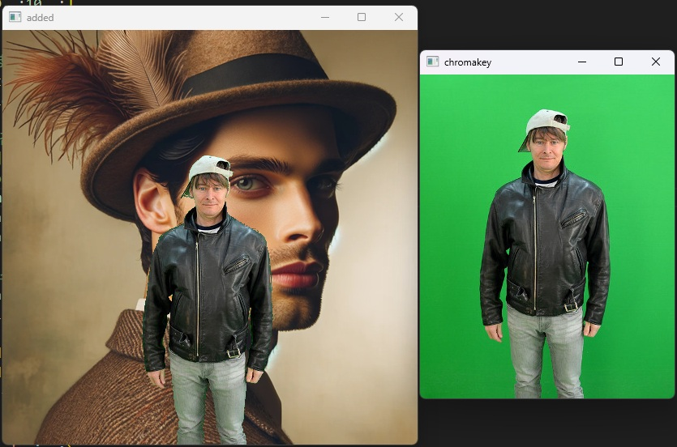
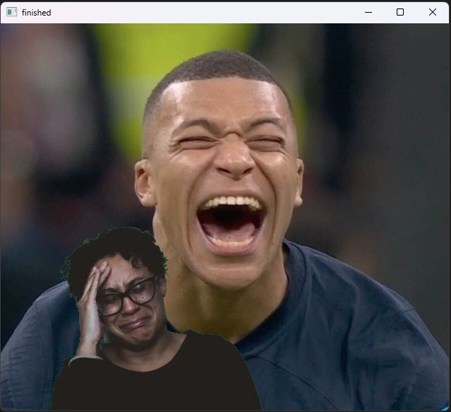
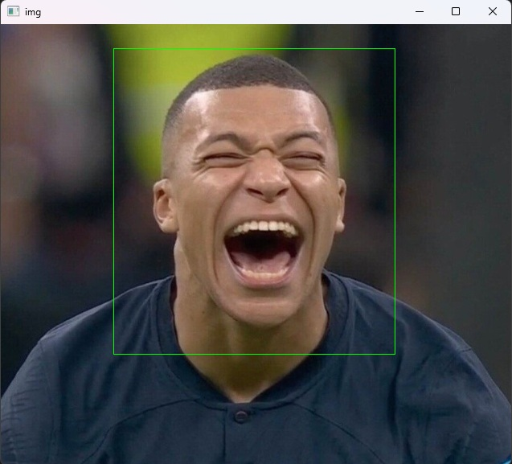
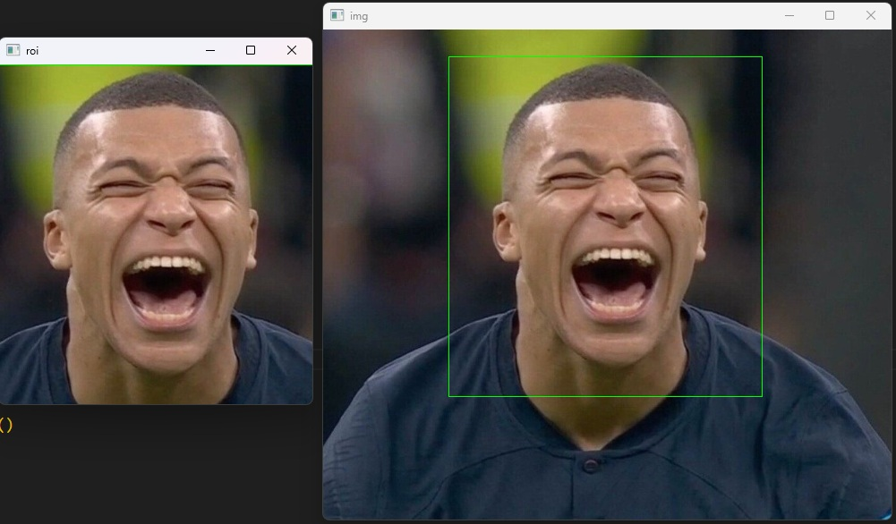
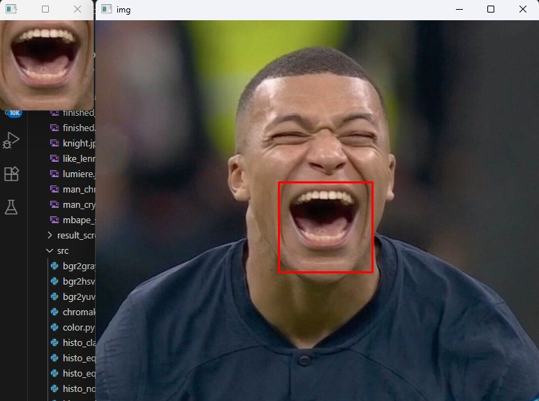
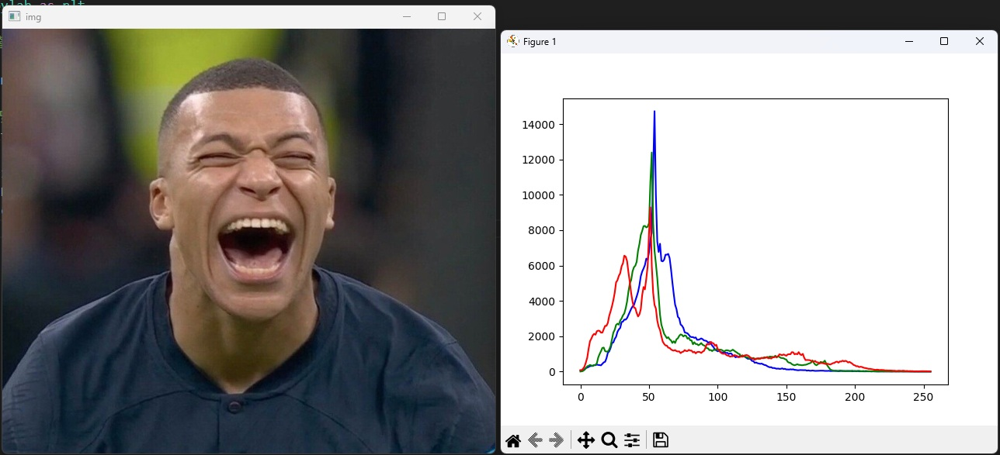
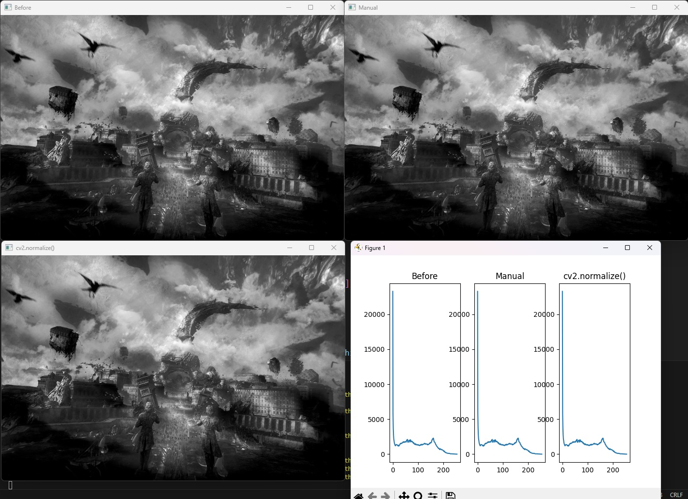

# OpenCV - Day 2

## 📡 Image Operations

**Date:** 2025-07-29  
**Author:** Sang-Min Byun

---

<br>

## 📋 Project Summary

⚫ **Image Operations**

This project demonstrates image **color processing**, binary image generation through **thresholding**, and image **compositing**.

The core idea:
- The image colors are represented using 3 methods: BGR(BGRA), HSV, YUV.
- Generate a binary image through thresholding using Otsu's binarization method to find optimal threshold without iteration.
- Using masking, extract only the subject from a photo with a chroma key background, and then composite it with a photo of a different background.
  - The photo with a chroma key background should be smaller than the other photo that be composited.


<br>

## 🟥 Representing the image colors

### 📷 Python Code (color.py)

This code displays the image in three formats: the original format, BGR format, and BGRA format.

```python
import cv2
import numpy as np

# 기본값
img = cv2.imread('../img/like_lenna.png')

# bgr
bgr = cv2.imread('../img/like_lenna.png', cv2.IMREAD_COLOR)

# a
bgra = cv2.imread('../img/like_lenna.png', cv2.IMREAD_UNCHANGED)

# shape
print("default", img.shape, "color", bgr.shape, "unchanged", bgra.shape)

# 이미지 보여주기
cv2.imshow('img', img)
cv2.imshow('bgr', bgr)
cv2.imshow('alpha', bgra[:,:,3])

cv2.waitKey(0)
cv2.destroyAllWindows()

```

### 📷 **Result Screenshot:**


<br>

---

<br>

### 📷 Python Code (bgr2gray.py)

This code displays the image in three format: the original format, gray format 1, gray format 2.  
Gray format 1 image is generated by method using average value.  
Gray format 2 image is generated by method using cv2.cvtcolor(img, flag) function.

```python
import cv2
import numpy as np

img = cv2.imread('../img/like_lenna.png')

img2 = img.astype(np.uint16)                # dtype 변경 ---①
b,g,r = cv2.split(img2)                     # 채널 별로 분리 ---②
#b,g,r = img2[:,:,0], img2[:,:,1], img2[:,:,2]
gray1 = ((b + g + r)/3).astype(np.uint8)    # 평균 값 연산후 dtype 변경 ---③

gray2 = cv2.cvtColor(img, cv2.COLOR_BGR2GRAY) # BGR을 그레이 스케일로 변경 ---④
cv2.imshow('original', img)
cv2.imshow('gray1', gray1)
cv2.imshow('gray2', gray2)

cv2.waitKey(0)
cv2.destroyAllWindows()

```

### 📷 **Result Screenshot:**


<br>

---

<br>

### 📷 Python Code (bgr2hsv.py, bgr2yuv.py)

These codes display the image in RGB color system.  
The two codes convert the BGR format into the HSV and YUV formats, respectively.

```python
# BGR 값을 HSV로 변환

import cv2
import numpy as np

#---① BGR 컬러 스페이스로 원색 픽셀 생성
red_bgr = np.array([[[0,0,255]]], dtype=np.uint8)   # 빨강 값만 갖는 픽셀
green_bgr = np.array([[[0,255,0]]], dtype=np.uint8) # 초록 값만 갖는 픽셀
blue_bgr = np.array([[[255,0,0]]], dtype=np.uint8)  # 파랑 값만 갖는 픽셀
yellow_bgr = np.array([[[0,255,255]]], dtype=np.uint8) # 노랑 값만 갖는 픽셀

#---② BGR 컬러 스페이스를 HSV 컬러 스페이스로 변환
red_hsv = cv2.cvtColor(red_bgr, cv2.COLOR_BGR2HSV);
green_hsv = cv2.cvtColor(green_bgr, cv2.COLOR_BGR2HSV);
blue_hsv = cv2.cvtColor(blue_bgr, cv2.COLOR_BGR2HSV);
yellow_hsv = cv2.cvtColor(yellow_bgr, cv2.COLOR_BGR2HSV);

#---③ HSV로 변환한 픽셀 출력
print("red:",red_hsv)
print("green:", green_hsv)
print("blue", blue_hsv)
print("yellow", yellow_hsv)

```

### 📷 **Result Screenshot:**


<br>

---

<br>

```python
# BGR 값을 YUV로 변환

import cv2
import numpy as np

#---① BGR 컬러 스페이스로 3가지 밝기의 픽셀 생성
dark = np.array([[[0,0,0]]], dtype=np.uint8)        # 3 채널 모두 0인 가장 어두운 픽셀
middle = np.array([[[127,127,127]]], dtype=np.uint8) # 3 채널 모두 127인 중간 밝기 픽셀
bright = np.array([[[255,255,255]]], dtype=np.uint8) # 3 채널 모두 255인 가장 밝은 픽셀

#---② BGR 컬러 스페이스를 YUV 컬러 스페이스로 변환
dark_yuv = cv2.cvtColor(dark, cv2.COLOR_BGR2YUV)
middle_yuv = cv2.cvtColor(middle, cv2.COLOR_BGR2YUV)
bright_yuv = cv2.cvtColor(bright, cv2.COLOR_BGR2YUV)

#---③ YUV로 변환한 픽셀 출력
print("dark:",dark_yuv)
print("middle:", middle_yuv)
print("bright", bright_yuv)

```

### 📷 **Result Screenshot:**


<br>

---

<br>

### 📷 Python Code (threshold.py)

Global thresholding is a method where a certain threshold is set, and pixel values are assigned 255 if they exceed the threshold, or 0 if they do not.  
The code below displays the process activating global thresholding through numpy and cv2.threshold().

```python
import cv2
import numpy as np
import matplotlib.pylab as plt

# 이미지를 그레이 스케일로 읽기
img = cv2.imread('../img/like_lenna.png', cv2.IMREAD_GRAYSCALE)

# NumPy API로 바이너리 이미지 만들기
thresh_np = np.zeros_like(img)   # 원본과 동일한 크기의 0으로 채워진 이미지
thresh_np[ img > 127] = 255      # 127 보다 큰 값만 255로 변경

# OpenCV API로 바이너리 이미지 만들기
ret, thresh_cv = cv2.threshold(img, 127, 255, cv2.THRESH_BINARY)
# 바이너리 이미지에 사용된 문턱 값 반환
print(ret)

# 원본과 결과물을 matplotlib으로 출력
imgs = {'Original': img, 'NumPy API':thresh_np, 'cv2.threshold': thresh_cv}
for i , (key, value) in enumerate(imgs.items()):
    plt.subplot(1, 3, i+1)
    plt.title(key)
    plt.imshow(value, cmap='gray')
    plt.xticks([]); plt.yticks([])

plt.show()

```

### 📷 **Result Screenshot:**


<br>

---

<br>

### 📷 Python Code (threshold_otsu.py)

This code finds optimal threshold using Otsu's binarization method.

```python
import cv2
import numpy as np
import matplotlib.pylab as plt


# 이미지를 그레이 스케일로 읽기
img = cv2.imread('../img/like_lenna.png', cv2.IMREAD_GRAYSCALE)

# 경계값을 130으로 지정
_, t_130 = cv2.threshold(img, 130, 255, cv2.THRESH_BINARY)

# 경계값을 지정하지 않고 OTSU 알고리즘 선택
t, t_otsu = cv2.threshold(img, -1, 255, cv2.THRESH_BINARY | cv2.THRESH_OTSU)

# OTSU 알고리즘으로 선택된 경계값 출력
print('otsu threshold:', t)

imgs = {'Original': img, 't:130':t_130, 'otsu:%d'%t: t_otsu}
for i , (key, value) in enumerate(imgs.items()):
    plt.subplot(1, 3, i+1)
    plt.title(key)
    plt.imshow(value, cmap='gray')
    plt.xticks([]); plt.yticks([])

plt.show()

```

### 📷 **Result Screenshot:**


<br>

---

<br>

### 📷 Python Code (threshold_adapted.py)

Adaptive thresholding is a method finds optimal threshold using pixel values around divided image.  
The code below shows how to use adaptive thresholding.

```python
import cv2
import numpy as np 
import matplotlib.pyplot as plt 

blk_size = 9        # 블럭 사이즈
C = 5               # 차감 상수 
img = cv2.imread('../img/like_lenna.png', cv2.IMREAD_GRAYSCALE) # 그레이 스케일로  읽기

# ---① 오츠의 알고리즘으로 단일 경계 값을 전체 이미지에 적용
ret, th1 = cv2.threshold(img, 0, 255, cv2.THRESH_BINARY | cv2.THRESH_OTSU)

# ---② 어뎁티드 쓰레시홀드를 평균과 가우시안 분포로 각각 적용
th2 = cv2.adaptiveThreshold(img, 255, cv2.ADAPTIVE_THRESH_MEAN_C,\
                                      cv2.THRESH_BINARY, blk_size, C)
th3 = cv2.adaptiveThreshold(img, 255, cv2.ADAPTIVE_THRESH_GAUSSIAN_C, \
                                     cv2.THRESH_BINARY, blk_size, C)

# ---③ 결과를 Matplot으로 출력
imgs = {'Original': img, 'Global-Otsu:%d'%ret:th1, \
        'Adapted-Mean':th2, 'Adapted-Gaussian': th3}
for i, (k, v) in enumerate(imgs.items()):
    plt.subplot(2,2,i+1)
    plt.title(k)
    plt.imshow(v,'gray')
    plt.xticks([]),plt.yticks([])

plt.show()

```

### 📷 **Result Screenshot:**


<br>

---

### 📷 Python Code (threshold_adapted.py, project01.py)

Chroma key is a masking method using colors. (Usually green)  
This code composites a picture with green background to other picture with different background.

```python
import cv2
import numpy as np
import matplotlib.pylab as plt

#--① 크로마키 배경 영상과 합성할 배경 영상 읽기
img1 = cv2.imread('../img/man_chromakey.jpg')
img2 = cv2.imread('../img/like_lenna.png')

#--② ROI 선택을 위한 좌표 계산
height1, width1 = img1.shape[:2]
height2, width2 = img2.shape[:2]
x = (width2 - width1)//2
y = height2 - height1
w = x + width1
h = y + height1

#--③ 크로마키 배경 영상에서 크로마키 영역을 10픽셀 정도로 지정
chromakey = img1[:10, :10, :]
offset = 20

#--④ 크로마키 영역과 영상 전체를 HSV로 변경
hsv_chroma = cv2.cvtColor(chromakey, cv2.COLOR_BGR2HSV)
hsv_img = cv2.cvtColor(img1, cv2.COLOR_BGR2HSV)

#--⑤ 크로마키 영역의 H값에서 offset 만큼 여유를 두어서 범위 지정
# offset 값은 여러차례 시도 후 결정
#chroma_h = hsv_chroma[0]
chroma_h = hsv_chroma[:,:,0]
lower = np.array([chroma_h.min()-offset, 100, 100])
upper = np.array([chroma_h.max()+offset, 255, 255])

#--⑥ 마스크 생성 및 마스킹 후 합성
mask = cv2.inRange(hsv_img, lower, upper)
mask_inv = cv2.bitwise_not(mask)
roi = img2[y:h, x:w]
fg = cv2.bitwise_and(img1, img1, mask=mask_inv)
bg = cv2.bitwise_and(roi, roi, mask=mask)
img2[y:h, x:w] = fg + bg

#--⑦ 결과 출력
cv2.imshow('chromakey', img1)
cv2.imshow('added', img2)
cv2.waitKey()
cv2.destroyAllWindows()

```

### 📷 **Result Screenshot:**


<br>

---

```python
# 크로마키 방식을 응용한 project01

import cv2
import numpy as np
import matplotlib.pylab as plt

# 크로마키 배경 사진과 합성할 배경 사진 읽기
img1 = cv2.imread('../img/man_crying.png')
img2 = cv2.imread('../img/mbape_smiling.jpg')

# 좌표 계산
height1, width1 = img1.shape[:2]
height2, width2 = img2.shape[:2]

# 중앙에서 왼쪽으로 살짝 이동
x = (width2 - width1)//5
y = height2 - height1
w = x + width1
h = y + height1

# 크로마키 배경 영상에서 크로마키 영역을 10픽셀 정도로 지정
chromakey = img1[:10, :10, :]
offset = 20

# 크로마키 영역과 영상 전체를 HSV로 변경
hsv_chroma = cv2.cvtColor(chromakey, cv2.COLOR_BGR2HSV)
hsv_img = cv2.cvtColor(img1, cv2.COLOR_BGR2HSV)

# 크로마키 영역의 H값에서 offset 만큼 여유를 두어서 범위 지정
# offset 값은 여러차례 시도 후 결정
# chroma_h = hsv_chroma[0]
chroma_h = hsv_chroma[:,:,0]
lower = np.array([chroma_h.min()-offset, 100, 100])
upper = np.array([chroma_h.max()+offset, 255, 255])

# 마스크 생성 및 마스킹 후 합성
mask = cv2.inRange(hsv_img, lower, upper)
mask_inv = cv2.bitwise_not(mask)
roi = img2[y:h, x:w]
fg = cv2.bitwise_and(img1, img1, mask=mask_inv)
bg = cv2.bitwise_and(roi, roi, mask=mask)
img2[y:h, x:w] = fg + bg

# 결과 출력
cv2.imshow('finished', img2)

# 이미지 저장
cv2.imwrite('../img/finished.jpg', img2)

# 이미지가 성공적으로 저장되었는지 확인
if cv2.imwrite('../img/finished.jpg', img2):
    print("이미지 저장 성공!")
else:
    print("이미지 저장 실패!")

cv2.waitKey()
cv2.destroyAllWindows()

```

### 📷 **Result Screenshot:**


<br>

---

## 📡 ROI, Histogram (Normalize, Equalization) and CLAHE

---

<br>

## 📋 Project Summary

⚫ **ROI, Histogram (Normalize, Equalization) and CLAHE**

This project demonstrates image's **ROI (Region Of Interest)**, displaying process using **Normalize**, **Equalization** and **CLAHE** through **Histogram**.

The core idea:
- ROI
- Histogram
- Normalize
- Equalizaion
- CLAHE


<br>

## 🟦 ROI

### 📷 python code (roi.py, roi_copy.py)

These codes display roi of images as green rectangular.

```python
# 관심영역 표시 (roi.py)

import cv2
import numpy as np

img = cv2.imread('../img/mbape_smiling.jpg')

x=140; y=30; w=350; h=380       # roi 좌표
roi = img[y:y+h, x:x+w]         # roi 지정        ---①

print(roi.shape)
cv2.rectangle(img, (x, y), (x+w, y+h), (0, 255, 0))
cv2.imshow("img", img)

# 이미지 저장
cv2.imwrite('../img/finished_emphasizing.jpg', img)

key = cv2.waitKey(0)
print(key)
cv2.destroyAllWindows()

```

### 📷 **Result Screenshot:**


<br>

---

```python
# 관심영역 복제 및 새 창에 띄우기 (roi_copy.py)

import cv2
import numpy as np

img = cv2.imread('../img/mbape_smiling.jpg')

x=140; y=30; w=350; h=380       # roi 좌표
roi = img[y:y+h, x:x+w]         # roi 지정        ---①

print(roi.shape)
cv2.rectangle(img, (x, y), (x+w, y+h), (0, 255, 0))
img2 = roi.copy()           # roi 배열 복제 ---①

cv2.imshow("img", img)      # 원본 이미지 출력
cv2.imshow("roi", img2)     # roi 만 따로 출력

# 이미지 저장
cv2.imwrite('../img/finished_emphasizing.jpg', img)
cv2.imwrite('../img/emphasized_part.jpg', img2)

cv2.waitKey(0)
cv2.destroyAllWindows()

```

### 📷 **Result Screenshot:**


<br>

---

### 📷 python code (roi_crop_mouse.py)

This code sets roi of images by using mouse.  
The roi is represented by red rectangular.

```python
# 마우스로 관심영역 지정 및 표시, 저장

import cv2
import numpy as np

isDragging = False                      # 마우스 드래그 상태 저장 
x0, y0, w, h = -1,-1,-1,-1              # 영역 선택 좌표 저장
blue, red = (255,0,0),(0,0,255)         # 색상 값 

def onMouse(event,x,y,flags,param):     # 마우스 이벤트 핸들 함수
    global isDragging, x0, y0, img      # 전역변수 참조
    if event == cv2.EVENT_LBUTTONDOWN:  # 왼쪽 마우스 버튼 다운, 드래그 시작
        isDragging = True
        x0 = x
        y0 = y
    elif event == cv2.EVENT_MOUSEMOVE:  # 마우스 움직임
        if isDragging:                  # 드래그 진행 중
            img_draw = img.copy()       # 사각형 그림 표현을 위한 이미지 복제
            cv2.rectangle(img_draw, (x0, y0), (x, y), blue, 2) # 드래그 진행 영역 표시
            cv2.imshow('img', img_draw) # 사각형 표시된 그림 화면 출력
    elif event == cv2.EVENT_LBUTTONUP:  # 왼쪽 마우스 버튼 업
        if isDragging:                  # 드래그 중지
            isDragging = False          
            w = x - x0                  # 드래그 영역 폭 계산
            h = y - y0                  # 드래그 영역 높이 계산
            print("x:%d, y:%d, w:%d, h:%d" % (x0, y0, w, h))
            if w > 0 and h > 0:         # 폭과 높이가 양수이면 드래그 방향이 옳음
                img_draw = img.copy()   # 선택 영역에 사각형 그림을 표시할 이미지 복제
                # 선택 영역에 빨간 사각형 표시
                cv2.rectangle(img_draw, (x0, y0), (x, y), red, 2) 
                cv2.imshow('img', img_draw) # 빨간 사각형 그려진 이미지 화면 출력
                roi = img[y0:y0+h, x0:x0+w] # 원본 이미지에서 선택 영영만 ROI로 지정
                cv2.imshow('cropped', roi)  # ROI 지정 영역을 새창으로 표시
                cv2.moveWindow('cropped', 0, 0) # 새창을 화면 좌측 상단에 이동
                cv2.imwrite('../img/cropped.jpg', roi)   # ROI 영역만 파일로 저장
                cv2.imwrite('../img/drawn_img.jpg', img_draw) # 빨간 사각형 그려진 이미지 파일로 저장
                print("croped.")
            else:
                cv2.imshow('img', img)  # 드래그 방향이 잘못된 경우 사각형 그림ㅇㅣ 없는 원본 이미지 출력
                print("좌측 상단에서 우측 하단으로 영역을 드래그 하세요.")

img = cv2.imread('../img/mbape_smiling.jpg')

cv2.imshow('img', img)
cv2.setMouseCallback('img', onMouse) # 마우스 이벤트 등록 ---⑧
cv2.waitKey()
cv2.destroyAllWindows()

```

### 📷 **Result Screenshot:**


<br>

---

<br>

## 🟩 Histogram (Normalize, Equalization) and CLAHE

### 📷 python code (histo_rgb.py)

This code displays the elements of images by histogram.

```python
import cv2
import numpy as np
import matplotlib.pylab as plt

#--① 이미지 읽기 및 출력
img = cv2.imread('../img/mbape_smiling.jpg')
cv2.imshow('img', img)

#--② 히스토그램 계산 및 그리기
channels = cv2.split(img)
colors = ('b', 'g', 'r')
for (ch, color) in zip (channels, colors):
    hist = cv2.calcHist([ch], [0], None, [256], [0, 256])
    plt.plot(hist, color = color)
plt.show()

```

### 📷 **Result Screenshot:**


<br>

---

### 📷 python code (histo_nomalization.py)

This code changes the light intensity of gray images effectively. 

```python
# 히스토그램 정규화

import cv2
import numpy as np
import matplotlib.pylab as plt

#--① 그레이 스케일로 영상 읽기
img = cv2.imread('../img/lumiere.jpg', cv2.IMREAD_GRAYSCALE)

#--② 직접 연산한 정규화
img_f = img.astype(np.float32)
img_norm = ((img_f - img_f.min()) * (255) / (img_f.max() - img_f.min()))
img_norm = img_norm.astype(np.uint8)

#--③ OpenCV API를 이용한 정규화
img_norm2 = cv2.normalize(img, None, 0, 255, cv2.NORM_MINMAX)

#--④ 히스토그램 계산
hist = cv2.calcHist([img], [0], None, [256], [0, 255])
hist_norm = cv2.calcHist([img_norm], [0], None, [256], [0, 255])
hist_norm2 = cv2.calcHist([img_norm2], [0], None, [256], [0, 255])

cv2.imshow('Before', img)
cv2.imshow('Manual', img_norm)
cv2.imshow('cv2.normalize()', img_norm2)

hists = {'Before' : hist, 'Manual':hist_norm, 'cv2.normalize()':hist_norm2}
for i, (k, v) in enumerate(hists.items()):
    plt.subplot(1,3,i+1)
    plt.title(k)
    plt.plot(v)
plt.show()

```

### 📷 **Result Screenshot:**


<br>

---

## 📦 Requirements

* Python
  - opencv
  - numpy
  - matplotlib
